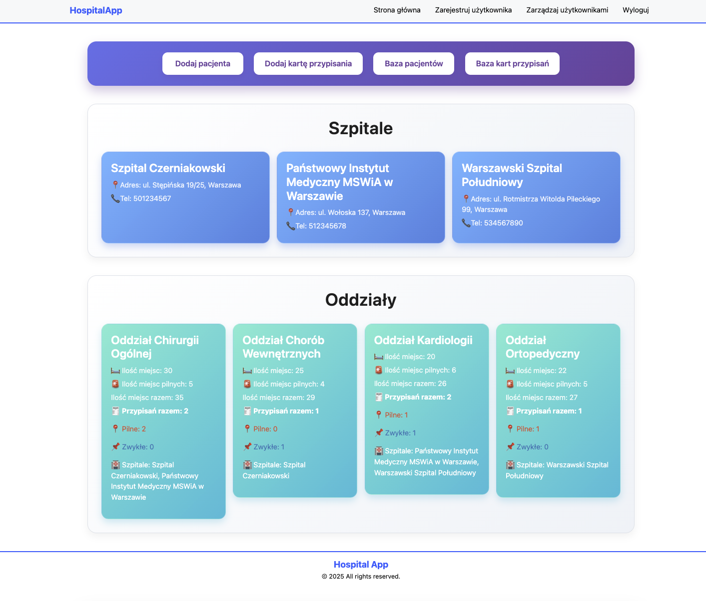
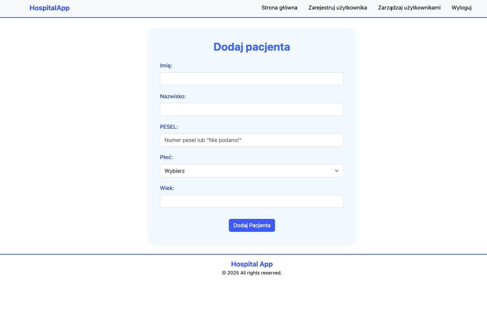
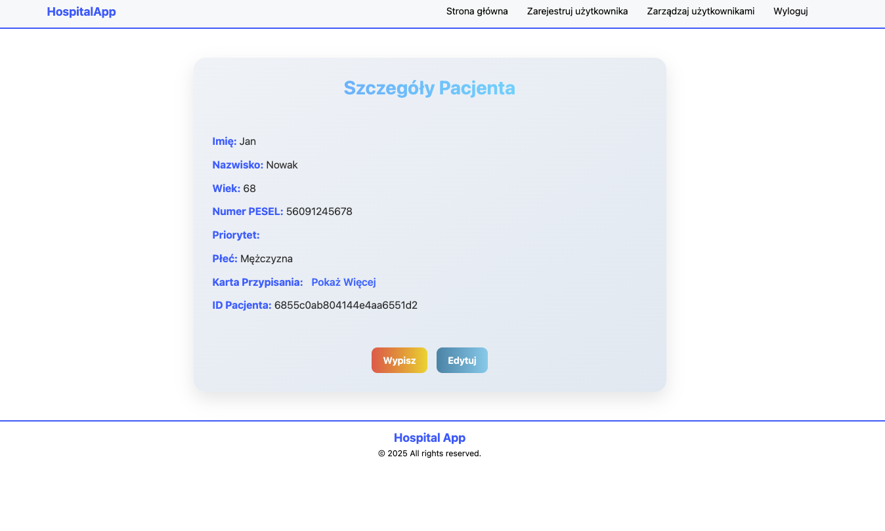
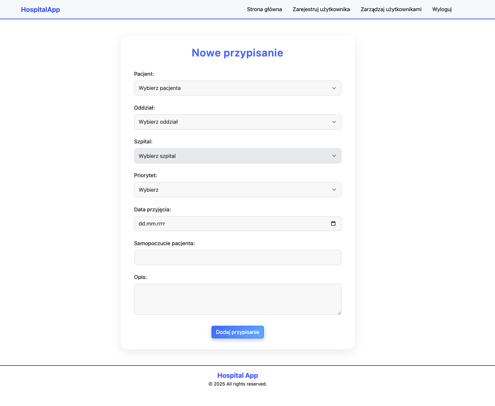
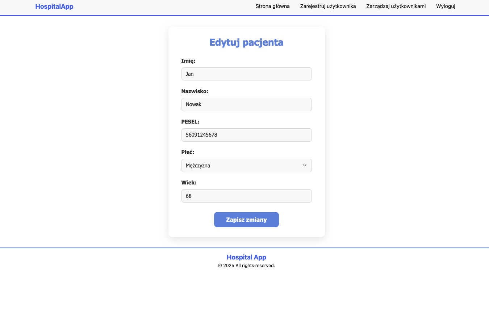
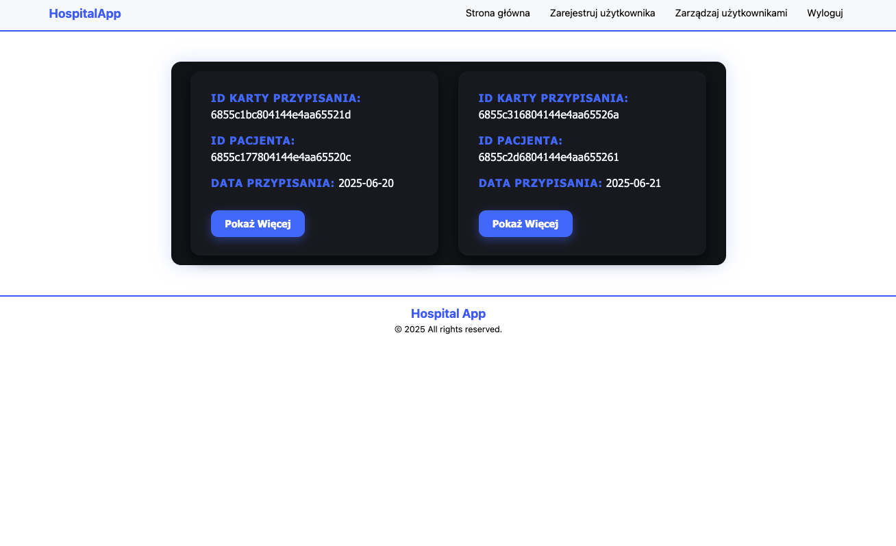

<!-- ──────────────────────────────────────────────────────────────────────────────  
 README – HospitalApp  
─────────────────────────────────────────────────────────────────────────────── -->

# HospitalApp 🏥  
> **MERN Stack • Full CRUD • Custom Auth • File Upload • Role-based Access**

HospitalApp is a full-stack hospital management system.  
It allows medical staff to manage patients, visits, wards, and hospital data in one place.  
Created as a portfolio project to showcase full-stack skills — including backend logic, frontend UX, security, and deployment architecture.

---

## 📋 API Endpoints

### 🧍 Patients
| Method | Endpoint           | Description                                     |
|--------|--------------------|-------------------------------------------------|
| GET    | `/allPatients`     | Retrieves all patients                         |
| GET    | `/patient/:id`     | Retrieves a patient by ID                      |
| POST   | `/patient`         | Creates a new patient                          |
| PUT    | `/patient/:id`     | Updates an existing patient                    |
| DELETE | `/patient/:id`     | Deletes a patient and all related attributions |

### 🏥 Hospitals
| Method | Endpoint           | Description                                     |
|--------|--------------------|-------------------------------------------------|
| GET    | `/hospitals`       | Retrieves all hospitals                        |
| GET    | `/hospital/:id`    | Retrieves a hospital by ID                     |

### 🏢 Branches
| Method | Endpoint               | Description                                      |
|--------|------------------------|--------------------------------------------------|
| GET    | `/branches`            | Retrieves all branches                           |
| GET    | `/branch/:id`          | Retrieves a branch by ID                         |
| GET    | `/branchHosp/:id`      | Retrieves all branches within a specific hospital|

### 📑 Attributions
| Method | Endpoint                    | Description                                      |
|--------|-----------------------------|--------------------------------------------------|
| GET    | `/attributions`             | Retrieves all attributions                       |
| GET    | `/attribution/:id`          | Retrieves an attribution by ID                  |
| POST   | `/attribution`              | Creates a new attribution                        |
| PUT    | `/attribution/:id`          | Updates an attribution                           |
| DELETE | `/attribution/:id`          | Deletes an attribution                           |
| GET    | `/attributionByBranch/:id`  | Retrieves attributions for a specific branch     |
| GET    | `/attributionByHospital/:id`| Retrieves attributions for a specific hospital   |
| GET    | `/attributionByDoctor/:id`  | Retrieves attributions for a specific doctor     |
| GET    | `/attributionByPatient/:id` | Retrieves attributions for a specific patient    |

### 🔐 Auth / Users
| Method | Endpoint            | Description                                     |
|--------|---------------------|-------------------------------------------------|
| POST   | `/login`            | Logs in a user                                 |
| DELETE | `/logout`           | Logs out the current user                      |
| GET    | `/logged`           | Checks the currently logged-in user            |
| GET    | `/users`            | Retrieves all users (admin only)               |
| POST   | `/register`         | Registers a new user (admin only)              |
| DELETE | `/userremove/:id`   | Deletes a user by ID (admin only)              |

## Demo

| View                         | Screenshot |
|------------------------------|------------|
| **Dashboard**                |  |
| **Add Patient**              |  |
| **Patient Details**          |  |
| **Assign to Branches**       |  |
| **Modify Patient Data**      |  |
| **Branches prewiev**         |  |
---

## Features

| Category                     | Description |
|------------------------------|-------------|
| **Patients – Full CRUD**     | Add, update, delete, and view detailed patient profiles |
| **Medical Records**          | Create & update individual patient records |
| **Visit Scheduling**         | Schedule upcoming appointments with date |
| **Department Assignment**    | Assign patients to departments and specific hospitals |
| **User Management (Admin)**  | Admin can create new users with roles |
| **Custom Authentication**    | Session-based auth with bcrypt and role control (admin/staff) |
| **Responsive UI**            | Bootstrap 5, fully responsive and mobile-ready |
| **Security Measures**        | NoSQL injection protection, form validation, role-based views |

---

## Tech Stack

### Frontend

| Package / Tool                      | Version    | Purpose                     |
|-------------------------------------|------------|-----------------------------|
| **React**                           | ^19.1.0    | UI library                  |
| **react-dom**                       | ^19.1.0    | React DOM renderer          |
| **react-router-dom**                | ^7.6.1     | Routing                     |
| **Redux**                           | ^5.0.1     | State management            |
| **react-redux**                     | ^9.2.0     | Redux bindings for React    |
| **react-bootstrap**                 | ^2.10.10   | Bootstrap components        |
| **bootstrap**                       | ^5.3.6     | UI framework styling        |
| **sass**                            | ^1.89.1    | SCSS styling                |
| **sass-loader**                     | ^16.0.5    | Webpack Sass loader         |
| **react-scripts**                   | 5.0.1      | Build system (CRA)          |
| **@testing-library/react**          | ^16.3.0    | React component testing     |
| **@testing-library/jest-dom**       | ^6.6.3     | Custom Jest matchers        |
| **@testing-library/dom**            | ^10.4.0    | DOM testing utilities       |
| **@testing-library/user-event**     | ^13.5.0    | User event simulation       |
| **web-vitals**                      | ^2.1.4     | Performance metrics         |

### Backend

| Package / Tool         | Version    | Purpose                              |
|------------------------|------------|--------------------------------------|
| **Node.js**            | 20 LTS     | JavaScript runtime                   |
| **express**            | ^5.1.0     | Web framework                        |
| **mongodb**            | ^6.17.0    | Native MongoDB driver                |
| **mongoose**           | ^8.15.1    | MongoDB ODM                          |
| **express-session**    | ^1.18.1    | Session management                   |
| **connect-mongo**      | ^5.1.0     | MongoDB session store                |
| **bcryptjs**           | ^3.0.2     | Password hashing                     |
| **cors**               | ^2.8.5     | Cross-origin requests                |
| **mongo-sanitize**     | ^1.1.0     | NoSQL injection protection           |
| **dotenv**             | ^16.5.0    | Environment variable loader          |
| **nodemon** (dev)      | ^3.1.10    | Development server auto-reload       |
| **path**               | ^0.12.7    | Path utilities (core module wrapper) |

---

## Setup Instructions

> The frontend is built statically and served by the backend.

```bash
# Clone the repository
git clone https://github.com/mikolajchm/HospitalApp
cd hospitalapp

# Backend setup
cd backend
rm -rf node_modules
rm yarn.lock
yarn install

# Frontend build (if not already built)
cd ../frontend
yarn install
yarn build

# Copy the frontend build to backend/public
cp -r build ../backend/public

# Start the server
cd ../backend
yarn start
# App runs at http://localhost:8000